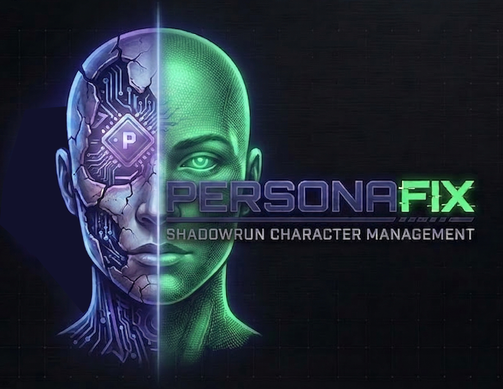

<div class="hero">
  
  <p class="hero-tagline">A cross-platform character creation and career management tool for Shadowrun 4th and 5th Edition.</p>
</div>

<div class="nav-bar">
  <a href="https://github.com/dmcbane/personafix/releases">Downloads</a>
  <a href="https://github.com/dmcbane/personafix">Source Code</a>
  <a href="https://github.com/dmcbane/personafix/blob/main/CONTRIBUTING.md">Contribute</a>
  <a href="https://github.com/dmcbane/personafix/blob/main/CHANGELOG.md">Changelog</a>
</div>

## What is personafix?

personafix is a desktop application for building and managing Shadowrun characters. It supports both 4th Edition (Build Points) and 5th Edition (Priority System) in a single app, with a pure Rust rules engine that enforces game mechanics in real time.

Your characters live in portable `.srx` files (SQLite databases) that you can copy, share, or back up with any file manager. Every change is recorded in an append-only career ledger, so you always have a complete history.

## Download

Releases are available on the [GitHub Releases page](https://github.com/dmcbane/personafix/releases).

| Platform | Format |
|----------|--------|
| Windows | `.msi` installer or `.exe` (NSIS) |
| macOS | `.dmg` disk image |
| Linux | `.AppImage` (portable) or `.deb` (Debian/Ubuntu) |

## Features

### Character Creation
- **SR4 Build Points** — 400 BP budget with real-time validation of attribute bounds, skill caps, quality limits, and resource allocation
- **SR5 Priority System** — interactive priority table (A-E) for Metatype, Attributes, Magic/Resonance, Skills, and Resources with smart swap
- **All 5 core metatypes** — Human, Elf, Dwarf, Ork, Troll with edition-accurate racial attribute limits

### Career Tracking
- **Append-only ledger** — every karma gain, nuyen transaction, skill improvement, and gear purchase is recorded as an event
- **Full history** — view your character's complete career timeline
- **Undo-safe** — the current character sheet is always re-projected from the creation base plus all events

### Portable Data
- **One file per campaign** — `.srx` is just a SQLite database
- **No cloud required** — fully offline, no account needed
- **Import game data** — migrates SR4 and SR5 data from ChummerGenSR4 and Chummer5a XML files

## Getting Started

1. Download the installer for your platform from the [releases page](https://github.com/dmcbane/personafix/releases)
2. Install and launch personafix
3. Create a campaign
4. Create a character (choose edition and metatype)
5. Build your runner: set attributes, add skills, pick qualities
6. Save and start logging career events

## For Developers

### Tech Stack
- **Rules engine** — Rust (pure, no I/O — compiles to native + WASM)
- **Desktop shell** — [Tauri 2.x](https://tauri.app/)
- **Frontend** — React 19 + TypeScript + Tailwind CSS + Zustand
- **Database** — SQLite (one file per campaign)
- **CI/CD** — GitHub Actions (builds for Linux, macOS, Windows)

### Quick Start

```sh
git clone https://github.com/dmcbane/personafix.git
cd personafix
make install    # Install Node dependencies
make dev        # Launch the desktop app
make test       # Run all 153+ tests
```

## Disclaimer

personafix is a fan project. Shadowrun is a registered trademark of The Topps Company, Inc. This project is not affiliated with or endorsed by Topps, Catalyst Game Labs, or any official Shadowrun licensee. Game data is sourced from community-maintained Chummer repositories under their respective licenses.
